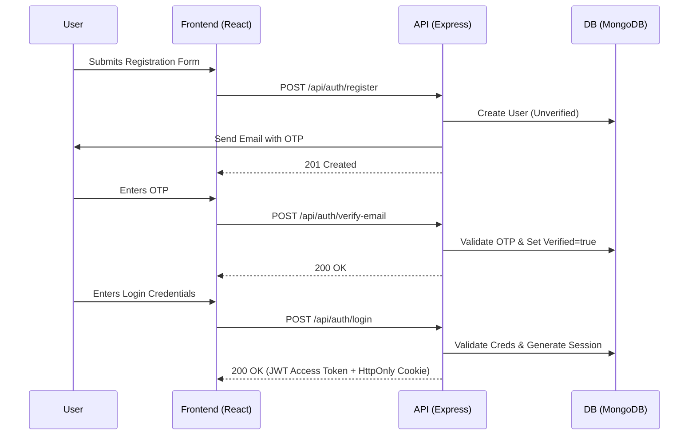
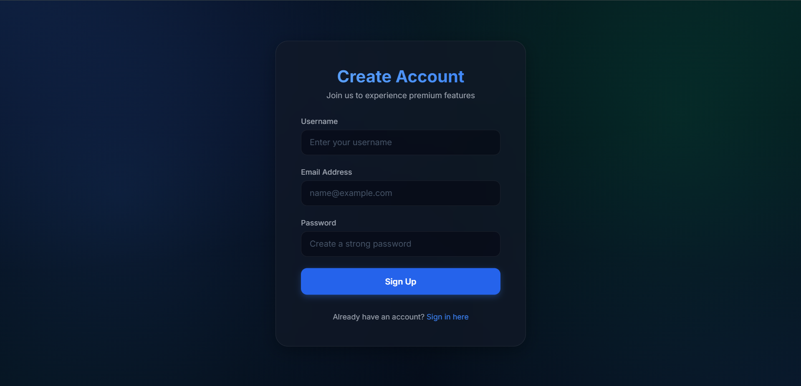
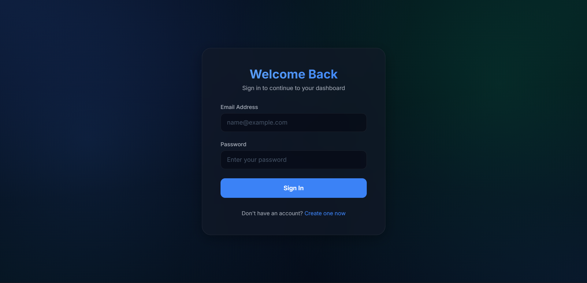
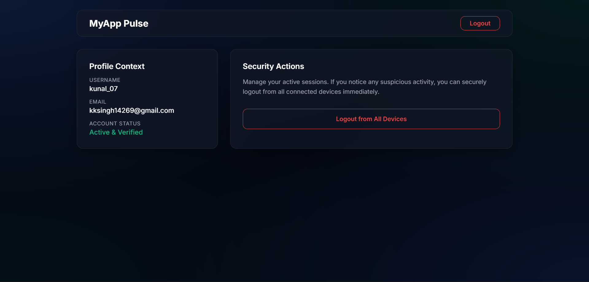

# Authentication System

A comprehensive, production-ready full-stack authentication system built using React (Vite), Express.js, and MongoDB. This project focuses on high-security standards, seamless user experience, and premium UI aesthetics.

## Features & Workflow

### 1. Registration Flow
- **User Input:** Username, Email, and strongly validated Password.
- **Backend Processing:** Checks for existing emails/usernames, hashes the password via `crypto`, and creates an unverified user record.
- **OTP Generation & Mailing:** A secure 6-digit OTP is generated, hashed, and stored in the database. The plain OTP is sent to the user's provided email via `nodemailer`.
- **Frontend State:** Redirects user to the OTP Verification screen.

### 2. Verification Flow
- **User Input:** 6-digit OTP received via email.
- **Backend Processing:** Hashes the input OTP and compares it against the OTP document linked to the email. If matched, updates the user's `verified` status to `true` and deletes the OTP document.
- **Frontend State:** Displays a success message and redirects to the Login screen.

### 3. Login Flow
- **User Input:** Email and Password.
- **Backend Processing:** Validates credentials. If successful and verified:
  - Generates a short-lived `accessToken` (15m).
  - Generates a long-lived `refreshToken` (7d) and hashes it for database storage.
  - Returns `accessToken` in JSON response and strictly sets `refreshToken` in a secure `HttpOnly` cookie.
- **Frontend State:** Stores `accessToken` in memory/localStorage, saves user context globally (React Context), and routes to the Dashboard.

### 4. Session & State Management
- **Token Refresh (Axios Interceptor):** If a request fails with `401 Unauthorized`, the frontend automatically calls `/api/auth/refresh-token` with the `refreshToken` cookie.
- **Backend Processing:** Validates the existing `refreshToken` and issues a new pair of tokens. This logic keeps the user seemingly logged in while constantly rotating keys for security.

### 5. Logout Flow
- **Single Device:** Revokes the specific Session document in the database and clears cookies/localStorage.
- **All Devices:** Traverses the database and marks all sessions associated with the `userId` as revoked.

## System Design

## Screenshots

> **Note:** Add screenshots here inside the `screenshot` directory.

### Registration Screen

### Login Screen

### Dashboard

## Tech Stack

- **Frontend:** React, React Router, Vite, Axios, Vanilla CSS (Premium Glassmorphism).
- **Backend:** Node.js, Express, Mongoose, JsonWebToken, Nodemailer, Cookie-parser.
- **Database:** MongoDB (Atlas).
